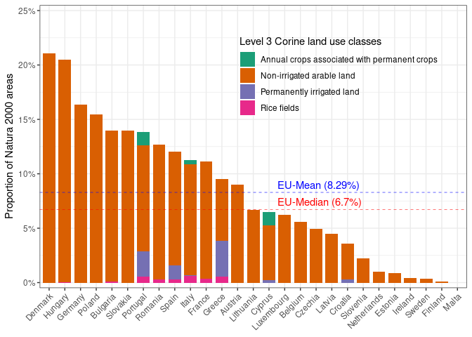

<!-- README.md is generated from README.Rmd. Please edit that file -->

# AgriPatterns_Natura2000

<!-- badges: start -->
<!-- badges: end -->

The goal of AgriPatterns_Natura2000 is to document the analyses for the
manuscript entitled “Ecological principles for designating areas for
afforestation that co-benefit biodiversity”. Specifically, this
repository explains how the proportions of different types of
agriculture in Natura 2000 nature protection areas are calculated for
various countries in the European Union.

## Required Packages

First, load the necessary packages:

``` r
library(tidyverse)
library(readr)
library(readxl)
library(forcats)
library(stringr)
library(terra)
library(RColorBrewer)
```

## Data Source

The data used in this analysis is derived from Corine Level 3 land use
data, retrieved from the [European Environmental
Agency](https://www.eea.europa.eu/en/analysis/maps-and-charts/natura-2000-data-viewer-dashboards#:~:text=The%20interactive%20map%20in%20the%20fifth%20page%20shows%20the%20percentage).
.

The dataset includes detailed information about land use types within
Natura 2000 areas across EU countries.

## Step 1: Loading the Data

The first step is to load the raw Corine Level 3 data:

``` r
#Loading data
level3 <- read_excel("level3.xlsx")
```

## Step 2: Calculating Total Natura 2000 Area per Country

Here, the total area of Natura 2000 regions is calculated for each
country by summing all numerical columns (land-use types) to compute the
total Natura 2000 area for each country.

``` r
natura2000_area <- level3 |>  
  mutate(natura2000_area = rowSums(across(where(is.numeric)), na.rm = T)) |>  
  distinct(country, .keep_all = T) |> 
  select(country, natura2000_area)
```

## Step 3: Preparing Data for Proportional Calculations

Next, we process the data to extract and transform agricultural
categories within Natura 2000 areas, here the dataset is converted to a
long format for easier handling of individual categories.

``` r
plot_dat_2 <- level3 |>  
  distinct(country, .keep_all = T) |>  
  select(c(1,13:23))  |>  
  pivot_longer(-1, values_to = "area", names_to = "category") |> 
  mutate(type_short = str_extract(category, "[A-Z].+")) |>  
  select(country, category, area, type_short)
```

## Step 4: Grouping and Recategorizing Agricultural Types

Agricultural land-use categories are grouped into broader
classifications, here we simplify detailed land-use categories into
meaningful groups for analysis.

``` r
plot_dat_2 <- plot_dat_2 |>  
  mutate(
    type_short_level_3 = case_when(
      type_short %in% c("Permanently irrigated land", "Annual crops associated with permanent crops", "Non-irrigated arable land", "Rice fields", "Complex cultivation patterns") ~ "Agriculture in rotation",
      type_short %in% c("Vineyards", "Fruit trees and berry plantations", "Olive groves", "Agro-forestry areas") ~ "Agroforestry and food trees",
      type_short == "Pastures" ~ "Permanent grassland",
      TRUE ~ type_short # Default to the existing value
  ))|>  
  filter(country != "Grand Total")
```

## Step 5: Calculating Proportions

Finally, the proportion of each agricultural type within Natura 2000
areas is calculated for each country

``` r
plot_dat_2 <- plot_dat_2 |> 
  left_join(natura2000_area, by = "country") |>  
  mutate(proportion_level_3 = area / natura2000_area) |>  
  reframe(proportion_level_3 = proportion_level_3,
          proportion_sum = sum(proportion_level_3, na.rm = T),
          type_short = type_short,
          .by = c(country, type_short_level_3))
```

# Plotting proportion of agriculture in Natura2000 areas including complex cultivation patterns

``` r
dark2_colors_max <- c("#1B9E77", "#D95F02", "#7570B3", "#E7298A", "#66A61E" )

# Relevel the 'type_short' factor to define the stacking order
order_levels <- c(
  "Annual crops associated with permanent crops",
  "Non-irrigated arable land",
  "Permanently irrigated land",
  "Rice fields",
  "Complex cultivation patterns"
)

summary_vals <- plot_dat_2 |> 
  filter(type_short_level_3 == "Agriculture in rotation") |>  
  summarize(
    median_val = round(median(proportion_sum, na.rm = TRUE), digits = 4),
    mean_val = round(mean(proportion_sum, na.rm = TRUE), digits = 4)
  )


plot_dat_2 |> 
  filter(type_short_level_3 == "Agriculture in rotation") |> 
  mutate(type_short = factor(type_short, levels = order_levels)) |>   # Relevel the 'type_short' variable
  ggplot(aes(x = fct_reorder(country, proportion_sum, .desc = TRUE), 
             y = proportion_level_3, 
             fill = type_short)) +
  theme_bw() +
  scale_fill_manual(values = dark2_colors_max, name = "Level 3 Corine land use classes") +  # Use Dark2 palette
  geom_bar(position = "stack", stat = "identity", width = 0.8) +
  theme(axis.title.x = element_blank(),  # Remove x-axis title (label)
        axis.text.x = element_text(angle = 45, hjust = 1),  # Keep x-axis text
        plot.title = element_text(hjust = 0.5),
        legend.background = element_blank(),
        legend.position = c(0.7, 0.78)) +
  scale_y_continuous(expand = c(0.02, 0), labels = scales::percent, limits = c(0, 0.25)) +
  geom_hline(yintercept = summary_vals$median_val, linetype = "dashed", color = "red", linewidth = 0.2) +  # Add stippled line
  geom_hline(yintercept = summary_vals$mean_val, linetype = "dashed", color = "blue", linewidth = 0.2) +  # Add stippled line
  annotate("text", x = 15, y = summary_vals$median_val, 
           label = paste0("EU-Median ", "(", summary_vals$median_val * 100, "%)"), 
           color = "red", hjust = -0.5, vjust = -0.5) +
  annotate("text", x = 15, y = summary_vals$mean_val, 
           label = paste0("EU-Mean ", "(", summary_vals$mean_val * 100, "%)"), 
           color = "blue", hjust = -0.6, vjust = 1.5) +
  ylab("Proportion of Natura 2000 areas")
```

<!-- -->

# plotting proportion agriculture excluding complex cultivation patterns

``` r
dark2_colors_min <- c("#1B9E77", "#D95F02", "#7570B3", "#E7298A")


# excluding complex cultivation patterns and calculating proportions for countries
plot_dat_2_min <- level3 %>% 
  distinct(country, .keep_all = T) %>% 
  #mutate("nat_area" = rowSums(across(where(is.numeric)), na.rm = T)) %>% 
  select(c(1,13:23)) %>% 
  pivot_longer(-1, values_to = "area", names_to = "category") %>% 
  filter(category != "Agriculture mosaics with significant natural vegetation") %>% 
  mutate(type_short = str_extract(category, "[A-Z].+")) %>% 
  select(1,3,4) %>% 
  mutate(type_short_level_3 = ifelse(type_short %in% c("Permanently irrigated land", "Annual crops associated with permanent crops", "Non-irrigated arable land", "Rice fields"), "Landbrug i omdrift", type_short)) %>% 
  mutate(type_short_level_3 = ifelse(type_short %in% c("Vineyards", "Fruit trees and berry plantations", "Olive groves", "Agro-forestry areas"), "Agro-forestry og fødevaretræer", type_short_level_3)) %>% 
  mutate(type_short_level_3 = ifelse(type_short == "Pastures", "Permanent græs", type_short_level_3)) %>% 
  filter(country != "Grand Total") %>% 
  left_join(., natura2000_area, by = "country") %>% 
  mutate(proportion_level_3 = area / natura2000_area) %>% 
  group_by(country, type_short_level_3) %>% 
  reframe(proportion_level_3 = proportion_level_3,
          proportion_sum = sum(proportion_level_3, na.rm = T),
          type_short = type_short)

# calculating median proportion agriculture 
median_val_min <- plot_dat_2_min %>% 
    filter(type_short_level_3 == "Landbrug i omdrift") %>% 
    pull(proportion_sum) %>% 
    median() %>% 
    round(., digits = 4)

# calculating mean proportion agricultiure
mean_val_min <- plot_dat_2_min %>% 
    filter(type_short_level_3 == "Landbrug i omdrift") %>% 
    pull(proportion_sum) %>% 
    mean() %>% 
    round(., digits = 4)

plot_dat_2_min %>% 
    filter(type_short_level_3 == "Landbrug i omdrift") %>% 
    ggplot(aes(x = fct_reorder(country, proportion_sum, .desc = TRUE), y = proportion_level_3, fill = type_short)) +
  theme_bw() +
  scale_fill_manual(values = dark2_colors_min, name = "Level 3 Corine land use classes") +  # Use Set3 palette
  geom_bar(position = "stack", stat = "identity", width = 0.8) +
  theme(axis.title.x = element_blank(),  # Remove x-axis title (label)
        axis.text.x = element_text(angle = 45, hjust = 1),  # Keep x-axis text
        plot.title = element_text(hjust = 0.5),
        legend.background=element_blank(),
        legend.position = c(0.7,0.75)) +
  scale_y_continuous(expand = c(0.02,0), labels = scales::percent, limits = c(0,0.25)) +
  geom_hline(yintercept = median_val_min, linetype = "dashed", color = "red", linewidth = 0.2) +  # Add stippled line
      geom_hline(yintercept = mean_val_min, linetype = "dashed", color = "blue", linewidth = 0.2) +  # Add stippled line

  annotate("text", x = 15, y = median_val_min, label = paste0("EU-Median ", "(",median_val_min*100,"%)"), color = "red", hjust = -0.1, vjust = -0.5) +
    annotate("text", x = 15, y = mean_val_min, label = paste0("EU-Mean ", "(",mean_val_min*100,"%)"), color = "blue", hjust = -0.1, vjust = -0.5)+
  ylab("Proportion of Natura 2000 areas")
```

<!-- -->
